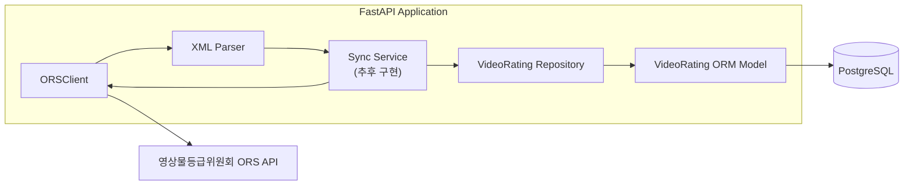

# PRD-002: 데이터베이스 저장

## 배경

- OPEN API로 비디오물 등급분류정보를 불러오는 작업은 완료
- 불러온 데이터를 지속적으로 보관하고 활용하기 위해 데이터베이스 저장 과정이 필요
- 추후 ORS 폴링 및 동기화 작업에서 사용할 저장 계층이 필요

---

## 목표

- ORS에서 수집한 비디오물 등급분류정보를 PostgreSQL에 저장할 수 있다.
- 등급분류번호를 기준으로 기존 데이터와 신규 데이터를 식별하여 저장 및 갱신할 수 있다.
- 데이터베이스 스키마 변경을 마이그레이션으로 관리할 수 있다.

---

## 사용자 스토리

### 등급분류정보 저장

**As a** 시스템  
**I want to** ORS에서 수집한 비디오물 등급분류정보를 데이터베이스에 저장하고 갱신하고 싶다.  
**So that** 수집한 데이터를 지속적으로 보관하고 이후 조회 및 활용할 수 있다.

### 완료 조건

- `VideoRating` 데이터를 데이터베이스에 저장할 수 있다.
- `rating_number`를 기준으로 데이터를 식별한다.
- 동일한 `rating_number`가 존재하지 않으면 새로운 데이터를 생성한다.
- 동일한 `rating_number`가 이미 존재하면 기존 데이터를 갱신한다.
- 선택 필드가 `None`인 데이터도 정상적으로 저장할 수 있다.
- 저장 계층의 동작을 테스트로 검증할 수 있다.

---

## 범위

### 포함

- PostgreSQL 개발 환경 구성
- 데이터베이스 설정 및 연결
- ORM 기반 `VideoRating` 모델 구현
- DB 마이그레이션
- 등급분류정보 저장 기능 구현
- 기존 데이터 갱신을 위한 upsert 지원
- 저장 계층 테스트

### 제외

- ORS 스케줄링 및 폴링
- 페이지 자동 순회
- 동기화 날짜 범위 결정
- 사용자용 조회 API
- 동기화 이력 관리

---

## 기술 스택

- Database: PostgreSQL
- ORM: SQLAlchemy 2.x
- PostgreSQL Driver: asyncpg
- Migration: Alembic
- Local Database: Docker Compose

---

## 데이터 식별

ORS의 `rating_number`(등급분류번호)를 비디오물 등급분류정보의 고유 식별자로 사용한다.

- 존재하지 않는 `rating_number`: INSERT
- 이미 존재하는 `rating_number`: UPDATE

---

## 흐름

