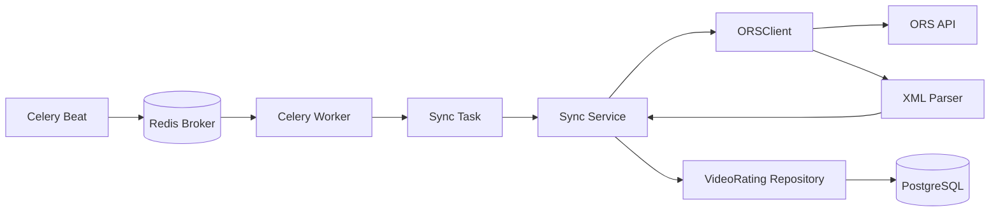

# PRD-003: 주기적 ORS 데이터 동기화

## 배경

- PRD-001에서 ORS 비디오물 등급분류정보 조회와 XML 파싱을 구현했다.
- PRD-002에서 `VideoRating`을 PostgreSQL에 저장하고 `rating_number` 기준 upsert를 구현했다.
- 현재는 `ORSClient`와 저장소가 직접 연결되어 있지 않아, 정해진 주기에 따라 데이터를 자동 수집할 수 없다.
- 수집 작업은 웹 프레임워크의 요청 생명주기와 분리되어야 하며, 향후 FastAPI에서 Litestar로 전환하더라도 재사용할 수 있어야 한다.

---

## 목표

- Celery worker가 기존 `ORSClient`를 통해 ORS 데이터를 주기적으로 조회한다.
- 조회한 데이터를 PostgreSQL에 중복 없이 저장하고 기존 데이터는 갱신한다.
- 여러 페이지의 응답을 안전하게 순회하고, 일시적인 외부 API·DB 오류는 재시도한다.
- 동기화 업무 로직을 FastAPI/Litestar와 독립된 서비스 계층으로 구성한다.

---

## 사용자 스토리

### 주기적 등급분류정보 동기화

**As a** 시스템  
**I want to** 정해진 주기마다 ORS에서 등급분류정보를 조회해 데이터베이스에 저장하고 싶다.  
**So that** 수동 요청 없이 최신 등급분류정보를 내부 데이터로 유지할 수 있다.

### 실패한 동기화 재처리

**As a** 운영자  
**I want to** 일시적인 네트워크·DB 오류가 발생한 동기화 작업이 자동으로 재시도되기를 원한다.  
**So that** 일시적인 장애 때문에 데이터 수집이 중단되지 않는다.

---

## 완료 조건

- Celery worker가 애플리케이션과 독립적으로 실행된다.
- Celery Beat 또는 동등한 스케줄러가 동기화 task를 정해진 주기로 발행한다.
- task가 등록 해제된 FastAPI 조회 API가 아니라 `ORSClient`를 직접 호출한다.
- 동기화 대상 업체와 조회 주기를 설정으로 관리할 수 있다.
- 각 업체의 조회 날짜 범위를 설정할 수 있다.
- ORS 응답의 `total_count`와 페이지 정보를 이용해 필요한 페이지를 자동 순회한다.
- 페이지 단위로 데이터를 저장하며, 한 페이지의 저장은 하나의 DB 트랜잭션으로 처리한다.
- 동일한 `rating_number`를 다시 수집해도 중복 행이 생성되지 않는다.
- 동일한 `rating_number`의 변경된 값은 기존 행에 반영된다.
- 선택 필드가 `None`인 데이터가 정상적으로 저장된다.
- 네트워크 timeout·HTTP 오류·일시적 DB 연결 오류에 대해 재시도 정책이 적용된다.
- 재시도할 수 없는 응답 오류는 무한 재시도하지 않고 실패 원인을 로그로 남긴다.
- 동기화 task는 FastAPI 또는 Litestar 애플리케이션을 실행하지 않고 테스트할 수 있다.
- 동기화 대상·조회 범위·처리 페이지·저장 건수·실패 원인이 로그에 남는다.

---

## 범위

### 포함

- Celery application 설정
- Redis broker 개발 환경 구성
- Celery worker 및 Beat 실행 설정
- ORS 조회 결과를 저장하는 Sync Service
- 여러 건을 한 트랜잭션으로 저장하는 `upsert_many()`
- 업체 목록·조회 주기·페이지 크기·조회 기간 설정
- 페이지 자동 순회
- task retry 및 오류 로깅
- 동기화 계층 단위 테스트와 PostgreSQL 통합 테스트

### 제외

- FastAPI에서 Litestar로의 프레임워크 전환
- 커뮤니티 기능
- 사용자용 등급분류정보 조회 API
- 동기화 이력 조회 화면과 운영자용 관리 화면
- Celery 관리자 UI 구축
- 임의의 대규모 과거 데이터 백필 정책

---

## 기술 스택

- Task queue: Celery
- Scheduler: Celery Beat
- Broker: Redis
- Database: PostgreSQL
- ORM/Driver: SQLAlchemy 2.x, asyncpg
- External API: 기존 `ORSClient`
- Local environment: Docker Compose

Celery task는 동기 실행 경계를 제공하고, 내부의 DB·동기화 로직은 현재 비동기 SQLAlchemy 구조를 재사용한다. 웹 프레임워크의 의존성 주입이나 라우터를 task 내부에서 사용하지 않는다.

---

## 설정

다음 설정과 기본값을 사용한다.

| 설정 | 설명 | 초안 기본값 |
|---|---|---|
| `CELERY_BROKER_URL` | Celery broker 주소 | `redis://redis:6379/0` |
| `CELERY_RESULT_BACKEND` | task 결과 저장소 | `redis://redis:6379/1` |
| `ORS_SYNC_COMPANIES` | 동기화 대상 업체 목록 | 필수, 최대 5개 |
| `ORS_SYNC_INTERVAL_SECONDS` | 동기화 실행 주기 | `1200` |
| `ORS_SYNC_PAGE_SIZE` | ORS 페이지 크기 | `1000` |
| `ORS_SYNC_WINDOW_DAYS` | 한 번에 조회할 날짜 범위 | `2` |
| `ORS_SYNC_MAX_API_CALLS_PER_DAY` | 일일 ORS 호출 예산 | `800` |
| `CELERY_TASK_MAX_RETRIES` | 최대 재시도 횟수 | `3` |
| `CELERY_RETRY_BACKOFF_MAX_SECONDS` | retry backoff 상한 | `900` |
| `CELERY_TASK_SOFT_TIME_LIMIT` | task soft timeout | `900` |
| `CELERY_TASK_TIME_LIMIT` | task hard timeout | `1200` |
| `CELERY_SYNC_LOCK_TTL_SECONDS` | 동기화 lock 보존 시간 | `1800` |

기존 `ORS_API_KEY`, `ORS_API_BASE_URL`, `DB_URL` 설정을 재사용한다. 인증키와 DB 비밀번호는 로그에 기록하지 않는다.

### 실행 스케줄

- 월요일부터 금요일까지 실행한다.
- 매일 09:00부터 18:40까지 20분 간격으로 실행한다.
- 18:40 실행을 포함해 평일마다 총 30회 실행한다.
- 토요일과 일요일에는 실행하지 않는다.
- 시간대는 `Asia/Seoul`을 사용한다.
- MVP에서는 공휴일을 별도로 판별하지 않고 월~금이면 실행한다.

---

## 동기화 흐름

### 처리 순서

1. Celery Beat가 동기화 task를 발행한다.
2. task가 설정된 업체와 조회 기간을 읽는다.
3. Sync Service가 업체별 첫 페이지를 `ORSClient.fetch()`로 조회한다.
4. 응답의 `items`를 `upsert_many()`로 저장한다.
5. `total_count`와 페이지 크기를 기준으로 다음 페이지를 조회한다.
6. 마지막 페이지까지 처리하면 업체 동기화를 성공으로 기록한다.
7. 일시적 오류가 발생하면 task retry 정책에 따라 재실행한다.

페이지 단위 commit을 사용하면 중간 페이지까지 저장된 뒤 작업이 실패할 수 있다. 재시도 시 `rating_number` 기준 upsert를 사용해 이미 저장된 페이지를 다시 처리해도 결과가 중복되지 않도록 한다.

---

## 조회 기간 정책

MVP에서는 동기화 이력 테이블이나 cursor를 별도로 두지 않고, 2일 rolling window를 사용한다.

- `end_date`: task 실행일
- `start_date`: `end_date - ORS_SYNC_WINDOW_DAYS`
- 늦게 반영되는 ORS 데이터를 고려해 날짜 범위를 일부 겹치게 조회할 수 있다.
- ORS 날짜 파라미터가 `YYYYMMDD` 단위이므로 같은 날짜에는 동일한 날짜 범위를 반복 조회하고, 날짜가 바뀔 때 window가 이동한다.

동기화 이력과 정확한 cursor 관리는 후속 PRD에서 다룬다.

---

## 오류 및 재시도 정책

### 재시도 대상

- ORS 요청 timeout
- ORS HTTP 5xx 또는 일시적인 네트워크 오류
- 일시적인 PostgreSQL 연결 오류

### 기본 처리

- exponential backoff를 사용한다.
- 최대 3회 재시도하며 backoff 상한은 900초로 둔다.
- retry 대기에는 0~30초의 jitter를 추가한다.
- XML 구조 오류·필드 변환 오류처럼 입력 자체를 수정해야 하는 오류는 자동 무한 재시도하지 않는다.
- 최종 실패 task는 업체, 조회 기간, 페이지, 원인만 로그로 남기며 인증키 등 민감정보는 제외한다.

---

## 중복 실행과 멱등성

- 동일 업체·동일 조회 기간의 task가 동시에 실행되지 않도록 실행 정책을 정의한다.
- 업체·조회 기간별 Redis lock을 사용한다.
- lock TTL은 1800초로 둔다.
- 저장 결과의 멱등성은 `rating_number` unique constraint와 PostgreSQL upsert로 보장한다.
- task 재시도와 페이지 재처리가 발생해도 최종 DB 행 수가 불필요하게 증가하지 않아야 한다.

---

## 테스트 계획

- Sync Service가 여러 페이지를 순회하는지 검증한다.
- `ORSClient` 응답을 mock해 페이지별 저장 요청을 검증한다.
- 동일 `rating_number`의 재수집이 update로 처리되는지 PostgreSQL에서 검증한다.
- 선택 필드 `None`이 실제 DB `NULL`로 저장되는지 검증한다.
- 한 페이지 저장 오류 후 transaction rollback이 일어나는지 검증한다.
- Celery task가 FastAPI/Litestar import 없이 직접 실행 가능한지 검증한다.
- timeout·HTTP 오류 재시도와 최종 실패 처리를 검증한다.
- Redis broker와 worker를 포함한 최소 smoke test를 별도로 둔다.

---

## 비기능 요구사항

- 웹 프레임워크 변경에 영향을 받지 않는 모듈 경계를 유지한다.
- task가 동일한 입력에 대해 여러 번 실행되어도 결과가 동일해야 한다.
- 외부 API 일일 호출 제한을 초과하지 않도록 일일 호출 예산을 800회로 둔다.
- 최대 5개 업체 기준으로 `업체 수 × 30회 × 페이지 수`를 계산하고, retry 호출도 예산에 포함한다.
- 업체별 처리 결과와 실패 위치를 추적할 수 있어야 한다.
- Celery task가 장시간 실행될 수 있으므로 worker timeout과 graceful shutdown 정책을 정의한다.

---

## 확정 정책

- Redis DB 0을 broker, Redis DB 1을 result backend로 사용한다.
- Redis는 기존 `docker-compose.yml`에 PostgreSQL과 함께 추가한다.
- 동기화 대상 업체는 환경변수로 관리하며 최대 5개로 제한한다.
- rolling window는 2일로 한다.
- 동기화 이력과 마지막 성공 cursor는 이번 PRD에서 제외하고 후속 PRD로 분리한다.
- 동시 실행 방지는 Redis lock으로 처리한다.
- 일일 ORS 호출 예산은 800회로 한다.
